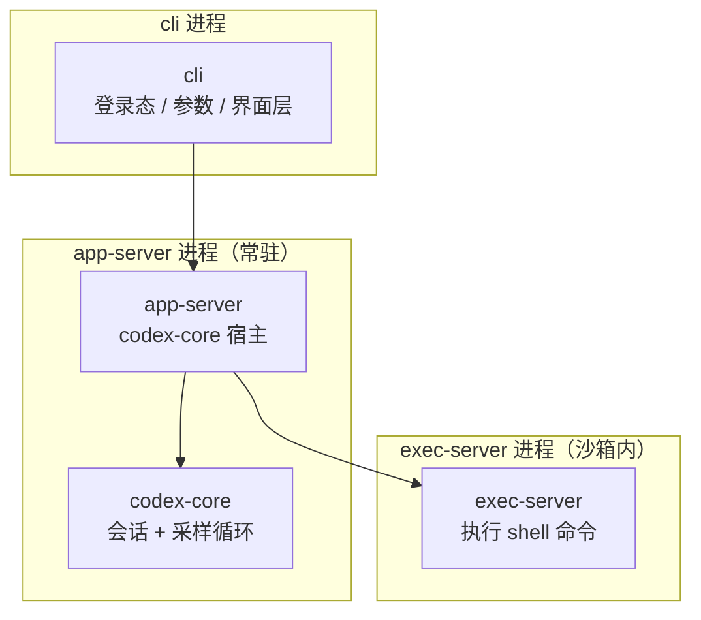

# 第 2 章：进程模型——三个进程怎么凑成一台机器

上一章是"有哪些零件"，这章是"运行时它们怎么接起来"。Codex 的 CLI 不是一个大进程从头干到尾，而是按**信任边界**拆成了几个进程。理解了这一点，后面看 `exec-server`、`app-server` 那些 crate 时就不会困惑"为什么非要多起一个进程"。

## 2.1 入口只是个"壳"

`codex` 这个二进制的所有参数和子命令，定义在 `cli/src/main.rs` 里的 `MultitoolCli` 和 `Subcommand`：

```rust
// cli/src/main.rs:115
struct MultitoolCli {
    #[clap(flatten)] pub config_overrides: CliConfigOverrides,
    #[clap(flatten)] pub feature_toggles: FeatureToggles,
    #[clap(flatten)] pub remote: InteractiveRemoteOptions,
    #[clap(flatten)] pub interactive: TuiCli,
    #[clap(subcommand)] subcommand: Option<Subcommand>,
}

// cli/src/main.rs:133
enum Subcommand {
    Agents(AgentsCommand),     // 浏览共享 app-server 上的所有会话
    Exec(ExecCli),             // 非交互式跑一次任务
    Review(ReviewCommand),     // 跑一次代码评审
    Login(LoginCommand),       // 登录
    Logout(LogoutCommand),     // 登出
    // ... 还有 MCP / Plugin / Queue / RemoteControl 等
}
```

关键点：**不写子命令时，参数会直接转交给交互式 CLI**（看 `subcommand_negates_reqs` 和 `override_usage` 里的说明注释）。也就是说 `codex "帮我改下登录页"` 和 `codex exec "..."` 走的是两条不同的路，但底层最终都汇聚到 `codex-core`。

## 2.2 三进程协作：cli / app-server / exec-server

运行时大致是这样：

```
codex (cli) ──启动──► app-server ──内部持有──► codex-core（会话+采样循环）
                         │
                         └──需要执行 shell 命令时──► exec-server（沙箱内）
```

- **进程 A：`cli`**。负责登录态、参数、以及"用哪种界面和你交互"。交互模式它会拉起 TUI（`codex-tui`）；非交互模式（`exec`）它就直接拿到结果输出后退出。
- **进程 B：`app-server`**。这是 `codex-core` 的"宿主进程"。把它单独拆出来，是为了让核心逻辑能**常驻**：IDE 插件、桌面 app、远程控制（`RemoteControl` 子命令）都能连到同一个 app-server，复用同一份会话状态，而不用每次都重新冷启动一个 agent。源码在 `app-server/`，对外契约在 `codex-app-server-protocol`。
- **进程 C：`exec-server`**。真正去 `fork`/跑命令的地方，而且被沙箱裹着。模型说"我要跑 `git push`"，这个请求会被序列化发给 exec-server，exec-server 先过一遍策略检查（能不能跑？碰哪些文件？），再在受限环境里执行，把输出流回来。

为什么要这么绕？一句话：**模型产出的指令不可信**。让"执行危险操作"的代码跑在一个和"持有你登录令牌、持有会话上下文"的代码不同的进程、甚至不同的沙箱里，能把一次 prompt injection 的爆炸半径压到最小。第 6 章会展开。



## 2.3 两条典型链路

**交互式（`codex` 进 TUI）**
```
你敲字 → TUI 渲染 → 通过 app-server 把 Op 喂给 core
       → core 采样循环跑模型 → 需要跑命令 → exec-server
       → 事件(Event)沿原路回流 → TUI 画出来
```

**非交互式（`codex exec "..."`）**
```
cli 直接构造一个 TurnInput 的 Op → core 跑完 → 把结果打到 stdout
（没有 TUI，没有常驻 app-server，干完即走）
```

对比一下就明白：`exec` 模式其实是把"交互式那条链路里的界面层"整个抽掉，只留核心。这正好解释了为什么 IDE 和 CI 都喜欢用 `exec` / app-server 的 JSON-RPC 接口——它们自己就是那个"界面层"。

下一章，我们钻进 `codex-core`，看它对外到底长什么样。
