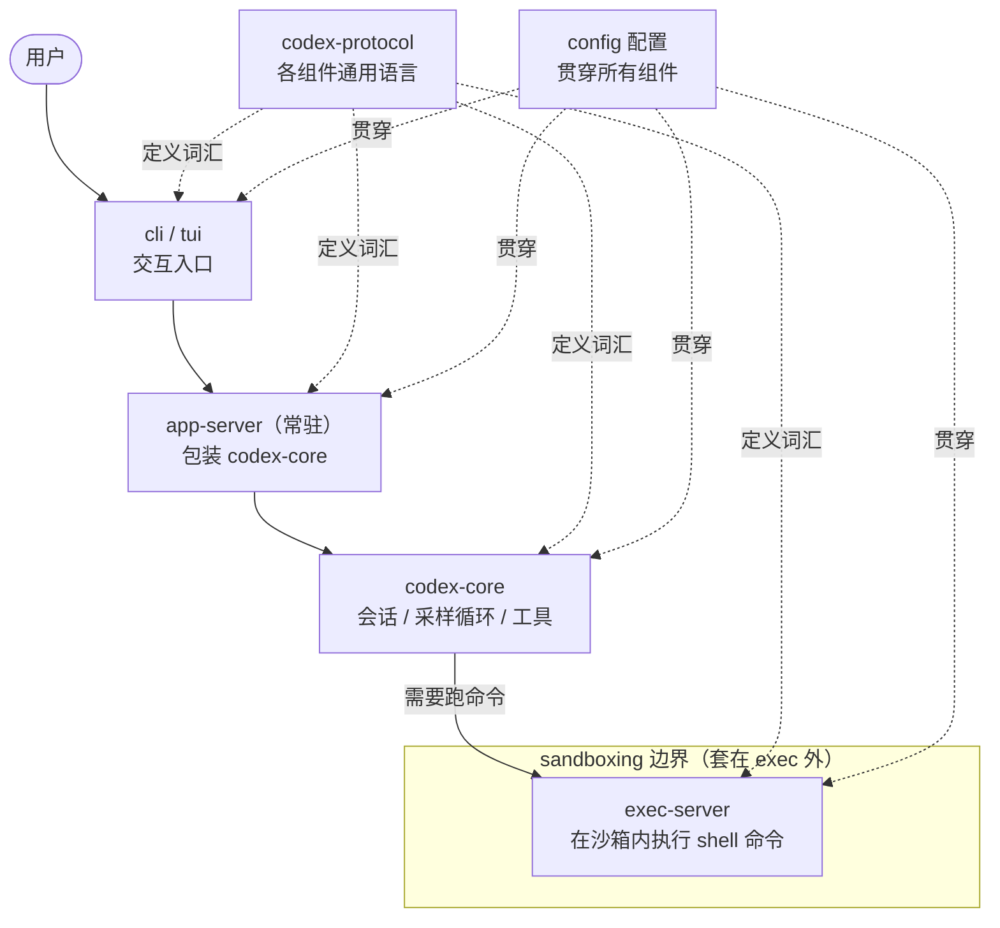

# 术语表与架构全景

读这本 guide 时反复撞到的词，先在这里统一对个暗号。每个词一句话大白话，后面标了它主要在哪章被掰开揉碎讲。

## 术语表

| 术语 | 大白话解释 | 主要出现在 |
| --- | --- | --- |
| **Op** | 你（或 IDE、桌面 app）发给 Codex 的"指令信封"，比如"开始一轮对话""同意跑这条命令"都装在这里面。 | [第 8 章：协议与 app-server](content/08-protocol.md) |
| **EventMsg** | Codex 回给你的"事件信封"，模型说了啥、命令跑出啥、出啥错，全靠它一路往外流。界面层就是它的"显示器"。 | [第 3 章：codex-core 公共 API](content/03-core-api.md) |
| **codex-core** | 整个项目的大脑，真正"想一步做一步"、管会话和工具的逻辑都在这一层。 | [第 3 章：codex-core 公共 API](content/03-core-api.md) |
| **app-server** | 把 codex-core 包成一个能跨进程/跨网络连的服务，IDE 和远程控制都靠它当"转接头"。 | [第 8 章：协议与 app-server](content/08-protocol.md) |
| **exec-server** | 真正动手执行命令、改文件的那个进程，和大脑分开跑，崩了也不带回核心一起死。 | [第 10 章：执行与运行时](content/10-runtime.md) |
| **sandbox（沙箱）** | 给命令划的一块"隔离牢笼"，限制它能碰哪些文件、走不走网络，防止跑飞了搞坏你的机器。 | [第 6 章：沙箱与安全](content/06-sandbox.md) |
| **MCP** | 一套标准插座，让 Codex 能接上外部工具和数据源，像挂 U 盘一样扩展能力。 | [第 11 章：扩展生态](content/11-extensions.md) |
| **skill** | 一段可复用的提示词/操作模板，你 `@` 一下就能把某类任务的经验塞进上下文。 | [第 11 章：扩展生态](content/11-extensions.md) |
| **hook** | 在回合关键节点自动插一脚的外部脚本，比如回合前自动检查、结束后自动发通知。 | [第 11 章：扩展生态](content/11-extensions.md) |
| **rollout** | 把一次完整会话原样录下来、事后能逐帧回放和审查的那套机制。 | [第 12 章：模型与上下文](content/12-model-ctx.md) |
| **TurnAborted** | "这一轮被中途打断"的信号，和"硬失败"不同，它让进程留着状态等你下一条输入，而不是直接崩。 | [第 4 章：主循环 run_turn](content/04-turn-loop.md) |
| **CodexErr** | 全仓库统一的错误类型，把各种底层报错归好类、区分"能不能重试"，再翻译成界面看得懂的事件。 | [第 13 章：工程化](content/13-engineering.md) |

## 架构全景：一张图看懂 Codex 怎么转

前面十三章把 Codex 拆成了仓库地形、进程模型、core 公共 API、主循环、工具、沙箱、协议、配置、运行时、扩展、模型与上下文、工程化……这一节把它们重新拼回一张图。一句话概括：你敲的每一个字从 `cli`/`tui` 出发，先进到常驻的 `app-server`（它把 `codex-core` 包成一个服务），`codex-core` 负责会话、跑采样循环、调度工具，真正要"动手跑命令"时再委托给沙箱里的 `exec-server`。而让这几个进程能互相听懂、又能各自独立演化的是 `codex-protocol`——一套谁也不依赖谁大脑的公共语言；`config` 则像一根线，从入口到内核一路贯穿。

### 大脑：谁在"想"

`codex-core` 的会话、采样循环、工具调度——也就是真正"动脑"的部分——集中在 [第 3 章：codex-core 公共 API](content/03-core-api.md) 与 [第 4 章：主循环 run_turn](content/04-turn-loop.md)。

### 进程边界：谁和谁住在哪个进程里

`cli`/`tui`、`app-server`、`exec-server` 各自独立的进程与边界划分，详见 [第 2 章：进程模型](content/02-process-model.md)、[第 8 章：协议与 app-server](content/08-protocol.md) 与 [第 10 章：执行与运行时](content/10-runtime.md)。

### 工具：core 怎么"动手"

工具系统如何被注册、调度并被采样循环调用，见 [第 5 章：工具系统](content/05-tools.md)。

### 协议：组件之间说什么语言

`codex-protocol` 作为各进程共享的无依赖类型层，以及它的类型生成机制，见 [第 8 章：协议与 app-server](content/08-protocol.md)。

### 配置：那根贯穿的线

`config` 从入口一路贯穿到内核的体系与分层加载，见 [第 9 章：配置系统](content/09-config.md)。
