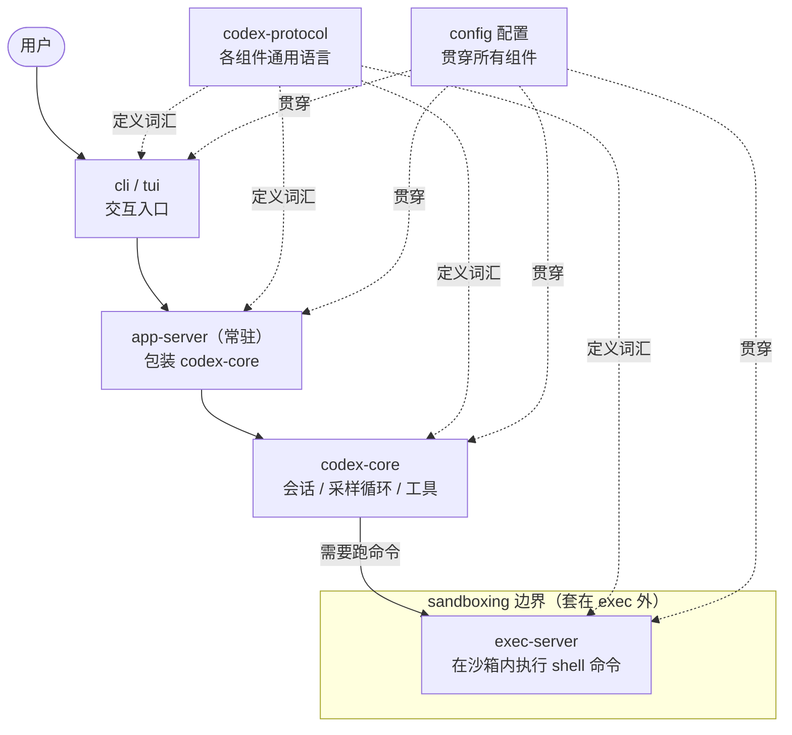

# 架构全景：一张图看懂 Codex 怎么转

前面二十多章把 Codex 拆成了仓库地形、进程模型、core 公共 API、主循环、工具、沙箱、协议、配置……这一页把它们重新拼回一张图。一句话概括：你敲的每一个字从 `cli`/`tui` 出发，先进到常驻的 `app-server`（它把 `codex-core` 包成一个服务），`codex-core` 负责会话、跑采样循环、调度工具，真正要"动手跑命令"时再委托给沙箱里的 `exec-server`。而让这几个进程能互相听懂、又能各自独立演化的是 `codex-protocol`——一套谁也不依赖谁大脑的公共语言；`config` 则像一根线，从入口到内核一路贯穿。

## 大脑：谁在"想"

`codex-core` 的会话、采样循环、工具调度——也就是真正"动脑"的部分——集中在 [第 3 章：codex-core 公共 API](content/03-core-api.md) 与 [第 4 章：主循环 run_turn](content/04-turn-loop.md)。

## 进程边界：谁和谁住在哪个进程里

`cli`/`tui`、`app-server`、`exec-server` 各自独立的进程与边界划分，详见 [第 2 章：进程模型](content/02-process-model.md)、[第 8 章：协议与 app-server](content/08-protocol.md) 与 [第 11 章：exec-server 执行链路](content/11-exec-server.md)。

## 工具：core 怎么"动手"

工具系统如何被注册、调度并被采样循环调用，见 [第 5 章：工具系统](content/05-tools.md)。

## 协议：组件之间说什么语言

`codex-protocol` 作为各进程共享的无依赖类型层，以及它的类型生成机制，见 [第 8 章：协议与 app-server](content/08-protocol.md) 与 [第 23 章：协议与类型生成](content/23-protocol-ts.md)。

## 配置：那根贯穿的线

`config` 从入口一路贯穿到内核的体系与分层加载，见 [第 9 章：配置系统](content/09-config.md) 与 [第 13 章：配置分层](content/13-config-layers.md)。
